# 🏎️ Awesome Reinforcement Learning Autonomous Racing

 

---

## 📌 Top Reinforcement Learning Autonomous Racing Ecosystem

**Curated List of SaaS Products & Open-Source GitHub Projects**  
*Focused on RL Training Environments, Autonomous Racing Simulators, Vehicle Dynamics & Self-Hosted Platforms*  

📅 **Last updated:** October 2026

This repository tracks notable **commercial SaaS RL autonomous racing platforms** and **open-source GitHub repositories** that train, test, and deploy reinforcement learning (RL) agents for autonomous driving and racing — from 1/18th scale cars to full-scale race cars and high-fidelity 3D simulators.

> [!NOTE]  
> **Key Focus Areas:** AWS DeepRacer, Wayve, Applied Intuition, CARLA, Donkey Car, F1TENTH, Unity ML-Agents, Foretellix, AirSim, and ROS2 ecosystem.

---

## 📑 Table of Contents

- [☁️ SaaS / Hosted Platforms](#-saas--hosted-platforms)
- [📦 Open-Source GitHub Projects](#-open-source-github-projects)
  - [🏁 Autonomous Racing Platforms](#-autonomous-racing-platforms)
  - [🚘 Autonomous Driving Simulators](#-autonomous-driving-simulators)
  - [🤖 RL Training Frameworks](#-rl-training-frameworks)
  - [⚡ Full AV Stacks & Additional Repos](#-full-av-stacks--additional-repos)
- [🤝 How to Contribute](#-how-to-contribute)
- [⚠️ Disclaimer](#%EF%B8%8F-disclaimer)
- [📈 Star History](#-star-history)

---

## ☁️ SaaS / Hosted Platforms

💡 **Market Size & Structure:** The global autonomous driving simulation and RL platform market is estimated at **~$4.8 Billion in 2026** and projected to grow at a **CAGR of ~27.5%**. The sector is currently **moderately fragmented**, with specialized enterprise simulation leaders (Applied Intuition, Cognata), cloud infrastructure giants (AWS, Microsoft), AI-native AV startups (Wayve), and niche verification providers (Foretellix).

*Sorted by Company Size / Valuation (Descending)* 📊

| Platform / Product 🚀 | Description & Primary Focus 📝 | Pricing (Starting Tier) 💰 | Free Tier / Trial Limit 🎁 | Company Size / Valuation 📊 |
| :--- | :--- | :--- | :--- | :--- |
| **[Microsoft AirSim Cloud](https://microsoft.github.io/AirSim/)** | Managed Azure cloud simulation infrastructure for drone & car RL training with Unreal/Unity. | $0.90 / hour (Azure NC6s_v3 GPU Instance) | $200 Azure free credit valid for 30 days (~220 free GPU simulation hours) | **$3.20 Trillion** (Market Cap) / **$245B** Rev |
| **[AWS DeepRacer](https://aws.amazon.com/deepracer/)** | AWS's 1/18th scale autonomous racing platform — train RL models in cloud simulation & deploy to physical scale cars. | $0.023 per minute ($1.38/hour) for model training & evaluation | 10 free hours of model training/evaluation in the first month (AWS Free Tier) | **$2.05 Trillion** (Market Cap) / **$100B+** AWS Rev |
| **[Unity ML-Agents](https://unity.com/products/machine-learning-agents)** | Managed enterprise multi-agent RL simulation environment toolkit built on Unity Engine. | $2,040 / user / year (Unity Pro license) | Unity Personal tier free for creators with <$200k/year funding or revenue | **$9.50 Billion** (Market Cap) / **$2.1B** Rev |
| **[Applied Intuition](https://www.appliedintuition.com/)** | High-fidelity enterprise simulation & validation platform for autonomous vehicle scale testing. | $50,000 / year starting seat license | 30-day sandbox trial with 100 scenario runs for qualified enterprise leads | **$6.00 Billion** (Valuation) / $600M+ Raised |
| **[Wayve](https://wayve.ai/)** | End-to-end deep learning AV platform for fleet simulation and autonomous navigation. | $100,000 / year enterprise partner API seat | 14-day partner API sandbox with 50 simulation benchmark runs upon approval | **$1.30 Billion** (Valuation) / $1.05B Series C |
| **[Foretellix](https://www.fortellix.com/)** | Coverage-driven safety verification & automated scenario test execution for ADAS / AV. | $3,500 / user / month | 30-day proof-of-concept trial license with up to 50 test scenario executions | **$95 Million** (Total Raised) / ~$20M Est. Rev |
| **[Cognata](https://www.cognata.com/)** | AI-driven 3D sensor & photorealistic terrain simulation platform for ADAS validation. | $2,500 / month per cloud simulator node | 14-day free trial with 20 simulation scenario hours | **$50 Million** (Total Raised) / ~$25M Est. Rev |
| **[CARLA Cloud](https://carla.org/)** | Cloud-managed CARLA simulation clusters with pre-configured GPU nodes for RL benchmarks. | $1.50 / GPU-hour (Managed AWS/GCP instance) | 5 free GPU compute hours for verified academic & open-source researchers | **~$10 Million** (Ecosystem Research Funding) |
| **[Donkey Car Cloud](https://www.donkeycar.com/)** | Managed web portal for remote Donkey Car model training, telemetry logs, and virtual race tracks. | $15 / month starting simulator cloud instance | Free tier with 2 virtual tracks & 1 hour/month cloud training | **~$2 Million** (Community Ecosystem Value) |

---

## 📦 Open-Source GitHub Projects

*Open-source repositories sorted by GitHub Stars (Descending)* ⭐

### 🏆 Complete Top Open-Source Repositories Ranking

| Repository 📦 | Stars ⭐️ | Category 🏷️ | Description & Key Features 🛠️ | License 📜 |
| :--- | :--- | :--- | :--- | :--- |
| **[Ray RLlib](https://github.com/ray-project/ray)** |  | RL Framework | Industry-standard distributed reinforcement learning framework built for high-throughput multi-agent driving simulation. | Apache-2.0 |
| **[Apollo](https://github.com/ApolloAuto/apollo)** |  | Full AV Stack | Baidu's high-performance open-source autonomous driving platform with full simulation and motion planning modules. | Apache-2.0 |
| **[Unity ML-Agents](https://github.com/Unity-Technologies/ml-agents)** |  | RL Framework | Open-source toolkit enabling games and 3D physics simulators to serve as environments for training RL agents. | Apache-2.0 |
| **[AirSim](https://github.com/microsoft/AirSim)** |  | AV Simulator | Microsoft's Unreal/Unity simulator for autonomous vehicles and robotics with hardware-in-the-loop support. | MIT |
| **[CARLA](https://github.com/carla-simulator/carla)** |  | AV Simulator | De facto standard open-source autonomous driving simulator built on Unreal Engine with ROS/ROS2 bridges and flexible sensor suites. | MIT |
| **[Stable Baselines3](https://github.com/DLR-RM/stable-baselines3)** |  | RL Framework | Reliable PyTorch implementations of reinforcement learning algorithms (PPO, SAC, TD3, A2C) widely used in autonomous driving. | MIT |
| **[Autoware](https://github.com/autowarefoundation/autoware)** |  | Full AV Stack | All-in-one open-source software stack for self-driving vehicles based on ROS 2 with localization, perception, and planning. | Apache-2.0 |
| **[Tianshou](https://github.com/thu-ml/tianshou)** |  | RL Framework | Modular PyTorch deep reinforcement learning platform featuring fast parallel sample collection for vehicle control. | MIT |
| **[Gym Retro](https://github.com/openai/retro)** |  | RL Environment | OpenAI's reinforcement learning environment for video games, used for benchmark racing control research. | MIT |
| **[CleanRL](https://github.com/vwxyzjn/cleanrl)** |  | RL Framework | Single-file implementations of Deep RL algorithms with transparent codebases for autonomous control experimentation. | MIT |
| **[Donkey Car](https://github.com/autorope/donkeycar)** |  | Racing Platform | Most popular open-source DIY self-driving RC car platform (1/16th to 1/10th scale) with Python, Keras, and RL support. | MIT |
| **[SUMO](https://github.com/eclipse-sumo/sumo)** |  | Traffic Simulator | Microscopic, multimodal traffic simulator for testing multi-agent autonomous driving policy interactions. | EPL-2.0 |
| **[LGSVL Simulator](https://github.com/lgsvl/simulator)** |  | AV Simulator | Unity-based multi-robot autonomous vehicle simulator with ROS / ROS2 and CyberRT integration. | Apache-2.0 |
| **[Gazebo Sim](https://github.com/gazebosim/gz-sim)** |  | Robotics Simulator | Open-source 3D robotics simulation environment for physical vehicle dynamics and sensor simulation. | Apache-2.0 |
| **[F1TENTH System](https://github.com/f1tenth/f1tenth_system)** |  | Racing Platform | Academic standard 1/10th scale autonomous racing platform with ROS2, LiDAR, and Gazebo simulation stack. | MIT |
| **[Pylot](https://github.com/erdos-project/pylot)** |  | Modular AV Platform | Modular autonomous driving platform designed for low-latency testing of RL motion planning algorithms on CARLA. | Apache-2.0 |
| **[AutoRally](https://github.com/AutoRally/autorally)** |  | Racing Platform | Georgia Tech's high-speed 1/5th scale autonomous aggressive racing vehicle platform designed for rough terrain. | BSD-3-Clause |
| **[MIT Racecar](https://github.com/mit-racecar/racecar)** |  | Racing Platform | Open-source hardware & software blueprint for 1/10th scale autonomous cars developed by MIT robotics engineers. | MIT |
| **[DeepRacer-for-Cloud](https://github.com/deepracer-on-cloud/deepracer-for-cloud)** |  | Training Ecosystem | Community training setup to train AWS DeepRacer RL models locally or on custom cloud VMs (GCP, Azure, local GPU). | MIT |
| **[BeamNGpy](https://github.com/BeamNG/beamngpy)** |  | Vehicle Dynamics | Official Python library for BeamNG.tech providing realistic soft-body vehicle physics for autonomous driving simulation. | MIT |
| **[AWS DeepRacer Launcher](https://github.com/aws-deepracer/aws-deepracer-launcher)** |  | Racing Platform | Core ROS2 packages for AWS DeepRacer 1/18th scale vehicle compute, camera inputs, and motor controllers. | Apache-2.0 |
| **[AWS DeepRacer SimApp](https://github.com/aws-deepracer/aws-deepracer-simapp)** |  | Racing Simulator | Official Gazebo simulation application for AWS DeepRacer reward function evaluation and track generation. | Apache-2.0 |

---

### 🏎️ Categorized Highlights & Ecosystem Guide

#### 1. 🏁 Autonomous Racing Platforms
- **[Donkey Car](https://github.com/autorope/donkeycar)** — DIY scale autonomous car platform built with Python, Raspberry Pi, and TensorFlow/PyTorch.
- **[F1TENTH System](https://github.com/f1tenth/f1tenth_system)** — Standardized 1/10th scale ROS2-based race car for international university racing leagues.
- **[AutoRally](https://github.com/AutoRally/autorally)** — High-speed aggressive autonomous driving testbed capable of 90 km/h drift dynamics.
- **[AWS DeepRacer](https://github.com/aws-deepracer/aws-deepracer-launcher)** — Official open-source ROS2 stack powering AWS DeepRacer physical cars.

#### 2. 🚘 Autonomous Driving Simulators
- **[CARLA](https://github.com/carla-simulator/carla)** — Premier Unreal Engine simulator with multi-GPU support, weather variations, and urban maps.
- **[AirSim](https://github.com/microsoft/AirSim)** — High-fidelity physical and visual simulation environment by Microsoft for autonomous systems.
- **[BeamNGpy](https://github.com/BeamNG/beamngpy)** — Python interface to BeamNG's soft-body physics engine for vehicle damage and suspension dynamics.

#### 3. 🤖 RL Training Frameworks
- **[Ray RLlib](https://github.com/ray-project/ray)** — Scale reinforcement learning workloads seamlessly from single laptop to multi-node clusters.
- **[Stable Baselines3](https://github.com/DLR-RM/stable-baselines3)** — Battle-tested PyTorch implementations of PPO, SAC, and TD3 algorithms.
- **[Unity ML-Agents](https://github.com/Unity-Technologies/ml-agents)** — Flexible C# / Python interface to train intelligent agents in custom 3D tracks.

---

## 🤝 How to Contribute

We welcome contributions from researchers, autonomous racing developers, and open-source enthusiasts! 🚀

1. 🍴 **Fork** this repository.
2. 📝 **Add or update** entries in `README.md` following the standard table formatting.
3. 🔎 **Provide accurate metadata**: Name, repository link, official star badge, pricing details, and license.
4. 📬 **Submit a Pull Request** with a clear explanation of your additions.

---

## ⚠️ Disclaimer

- 📖 **Community Curated:** This is an open community-curated list provided for educational and research purposes.
- 🏎️ **Safety First:** Physical autonomous racing vehicles can reach significant speeds and carry risks. Always operate physical vehicles in designated tracks with remote emergency kill-switches.
- 💻 **Compute Requirements:** High-fidelity 3D simulators (CARLA, AirSim, BeamNG) require dedicated GPU hardware for real-time RL training.
- 🔄 **Sim-to-Real Challenge:** Policy models trained exclusively in simulation may exhibit domain gap on physical race tracks. Use domain randomization and noise injection.

---

## 📈 Star History

---

**Made with ❤️ for RL researchers, autonomous racing drivers, and robotics engineers.**

